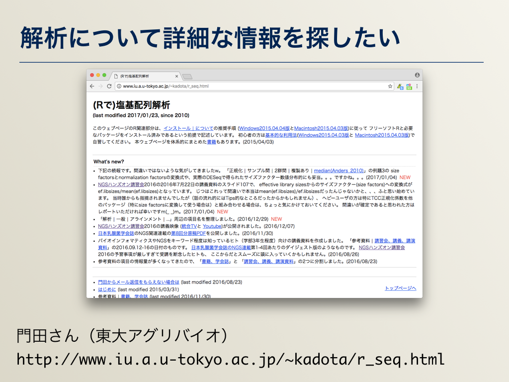
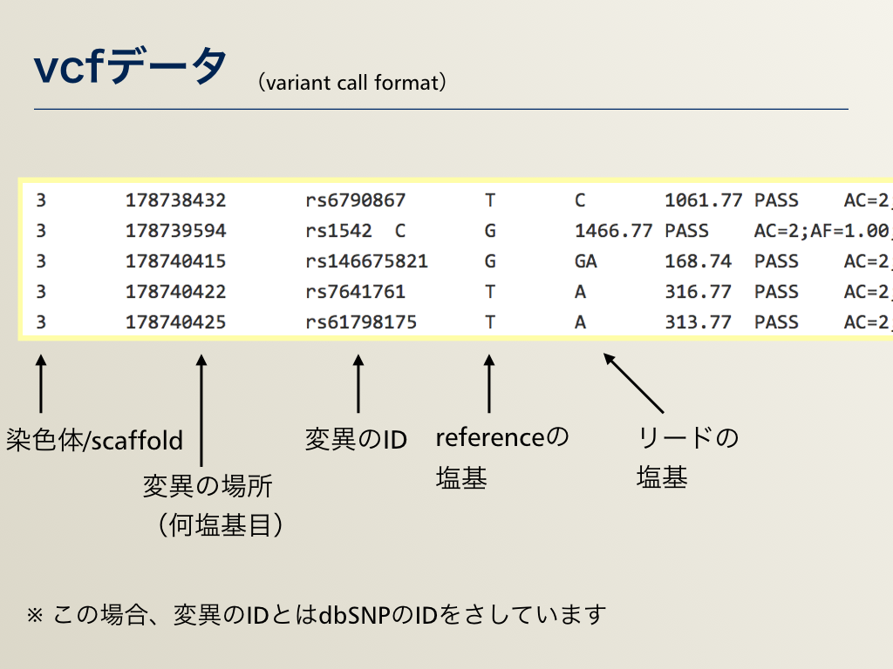

## AJACS名古屋2
# 次世代シーケンサー（NGS）と関連するデータベース・ツール

大学共同利用機関法人 情報・システム研究機構  
データサイエンス共同利用基盤施設  
ライフサイエンス統合データベースセンター
[仲里 猛留](http://data.dbcls.jp/~nakazato/)
nakazato@dbcls.rois.ac.jp
twitter: @chalkless

2018年12月5日（水）
愛知県がんセンター 国際医学交流センター

----

[AJACS名古屋2](https://events.biosciencedb.jp/training/ajacs73/) > 次世代シーケンサー（NGS）と関連するデータベース・ツール

----

## 次世代シーケンサ（とそのデータ）基礎知識
- 言葉
  - 次世代シーケンサ
  - 次世代シーケンサー
  - 新型シーケンサ
  - New-generation Sequencing (NGS)
  - Next-generation Sequencing (NGS)
  - 他にmassively parallel DNA sequencing とか...
  - 最近は、 High-throughput DNA sequencing (technology) をよく使う印象（略語はNGS）


## 何が新型／次世代なのか?
- 90年代
  - ゲル板
  - ポリアクリルアミドゲル電気泳動 + 蛍光標識ダイデオキシヌクレオチド

[](http://ja.wikipedia.org/wiki/DNA%E3%82%B7%E3%83%BC%E3%82%AF%E3%82%A8%E3%83%B3%E3%82%B7%E3%83%B3%E3%82%B0#.E6.A4.9C.E5.87.BA)
  - [DNAシークエンシング - Wikipedia -- 検出](http://ja.wikipedia.org/wiki/DNA%E3%82%B7%E3%83%BC%E3%82%AF%E3%82%A8%E3%83%B3%E3%82%B7%E3%83%B3%E3%82%B0#.E6.A4.9C.E5.87.BA)も参照

- 00年代
  - キャピラリ
[](http://motdb.dbcls.jp/?plugin=ref&page=AJACS48%2Fnakazato&src=capillary.jpg)
ABI PRISM&#174; 3100-Avant Genetic Analyzerより
- 10年代
  - NGSの登場
  - Sanger法（dideoxy法）→ パイロシーケンシング
  - （参考）[[原理の動画 (Illumina)](http://www.youtube.com/watch?v=l99aKKHcxC4)](http://www.youtube.com/watch?v=l99aKKHcxC4)
[]()
[次世代シーケンス解析サービス：概要・原理 | 北海道システム・サイエンス株式会社](http://www.hssnet.co.jp/2/2_3_10_1.html)より
  - ようするに顕微鏡＋インターバル撮影／タイムラプス撮影
    -インターバル撮影／タイムラプス撮影： http://www.youtube.com/watch?v=1Az1YX3GgDw
  - 超並列
  - どんなの?
    - Illumina HiSeq  
[]()
    - Illumina MiSeq  
[]()
    - PacBio
    []()
    - Ion Torrent

    - Togo picture gallery ( http://togotv.dbcls.jp/ja/pics.html ) より
[]()

&#169; 2011 DBCLS Licensed under CC 表示 2.1 日本
←クレジットをいれれば、転載・改変・再利用 OK


2016年7月時点でのシーケンサー各社の公称スペックをプロットしたもの (引用: Developments in high throughput sequencing – July 2016 edition, https://flxlexblog.wordpress.com/2016/07/08/developments-in-high-throughput-sequencing-july-2016-edition/ )。

## NGSデータの規模
- 【実習】どのくらいのデータ量になるか考えてみましょう
  - ゲル板：750 (base/lane) × 48/4 lanes <span style="color: rgb(250, 250, 250)">= 9kbase</span>
  - キャピラリ：500 (base/lane) × 96 lane <span style="color: rgb(250, 250, 250)">= 48kbase</span>
  - 次世代： 36 (base/seq) × 300M seq/run <span style="color: rgb(250, 250, 250)">= 10.8Gbase = 10,800,000kbase</span>
  - ↑これらの数字は規模感をつかむだけなので、ざっくりな数字になっています（1 runにかかる時間は比較してないですし）
  - ↑これらの数字は「塩基数」であって、シーケンサの出力である「画像データ」のデータサイズでないことに注意！
  - そして、その画像データはSRAには登録されていない

## NGSの利用範囲
  - ゲノム、発現解析、メタゲノム解析、ChIP-Seq（転写因子解析）、SNP解析、...
    - 目的によって必要なデータ量も違う  []()
    - 機器に合った利用を  []()

## 公共NGSデータベース
- Sequence Read Archive (SRA) というデータベース。NCBI（アメリカ）、EBI（ヨーロッパ）、DDBJ（日本）の3つでデータ交換をしている。
- SRA (NCBI)… [例](https://www.ncbi.nlm.nih.gov/sra/?term=SRA540189)
- ENA (European Nucleotide Archive, EBI)… [例](http://www.ebi.ac.uk/ena/data/view/PRJNA376601)
- DRA　(DDBJ sequence read archive)… [例](http://trace.ddbj.nig.ac.jp/DRASearch/study?acc=SRP100645)
 - 試しに検索してみましょう： http://trace.ddbj.nig.ac.jp/DRASearch/　　（キーワードで検索 → TypeをStudyで絞り込み。生物種でも）
- [DBCLS SRA](http://sra.dbcls.jp) （DBCLS） … いろいろな観点（目的、機器、生物種）からの絞り込みが可能。改修+DDBJと統合中
 - [文献からの検索](http://test-sra.dbcls.jp/cgi-bin/publication.cgi)
 - 疾患からの検索・[頻度](http://test-sra.dbcls.jp/cgi-bin/diseasefreq.cgi)・[階層構造表示](http://test-sra.dbcls.jp/cgi-bin/diseasetree.cgi)
 - [生物種からの絞り込み例](http://test-sra.dbcls.jp/cgi-bin/taxon2study.cgi?type=&platform=&taxon_id=&taxon_tree=on&taxon_in=Bacillus+subtilis) … 種→亜種・株、種→属→科の検索も可能

## 解析の概略
  []()

## 参考リソース
- 参考図書・その1 〜 実験もやる人向け
  []()

- 参考図書・その2 〜 解析を詳しく
  []()

- 詳細な解析をひととおり知りたい
  []()
        https://biosciencedbc.jp/human/human-resources/workshop/h28-2

- 解析について詳細な情報を探したい
  []()
        http://www.iu.a.u-tokyo.ac.jp/~kadota/r_seq.html

- 解析環境・コマンドラインベース
  []()
        http://www.iu.a.u-tokyo.ac.jp/~kadota/r_seq.html#bioinfo_ngs_sokushu_2016_20160719

- 解析環境・ウェブベース
  []()
        http://p.ddbj.nig.ac.jp/


## 実際の解析1：クオリティチェック・トリミング
- クオリティチェックには主にFASTQCというツールが使われます。  
  トリミングはさまざまなツールがあります（今回はtrim_galoreで例を示しています）

- 入力データ：FASTQフォーマット
  []()

- [参考] FASTAフォーマット
  []()

- 場合によっては（NCBIからダウンロードしたときなど）サイズ削減などのため、sra形式で圧縮されている場合があります。そのときはsra-toolkitでFASTQファイルを取り出したりします

- コマンド例
  - クオリティチェック

  `$ fastqc --nogroup -o DRR1234567.fastq`

  - トリミング

  `trim_galore --paired --illumina --fastqc -o trimmed/ DRR1234567.R1.fastq DRR1234567.R2.fastq`

- 結果例

  []()

  - HTMLファイルができると思ってください
  - 今回、発現解析のところで用いるデータ（デスクトップ＞AJACS_OWARI）の中にも実際のものがあります
  - DBCLS SRAではあらかじめFastQCをかけた結果を表示できるように随時、処理をしています（自分でやらなくてよい！）
  - 例： http://sra.dbcls.jp/search/view/SRR067385


## 実際の解析2−1：発現解析（mapping）

- ゲノムなどのリファレンス配列にNGSデータをマッピングします
- bowtie、tophat2などなどさまざまなツールがあります
- 発現解析程度なら速度重視、SNP解析なら精度重視とツールも変わります
- 名前が違うだけで、中身は複数のツールの組み合わせということも多々あります
- コマンド例：マッピング

  `hisat2 -f -p 24 -x genome.idx -U DRR1234567.trimmed.fasta -S results.sam`

- 結果：sam/bamフォーマット

  []()


- コマンド例：形式変換
- マッピングはsam形式かbam形式で出力されます  
  samは人間が読めるがサイズが大きいです。bamはプログラムで扱えるように（サイズを小さくするためにも）なっていますが人間には読めません

  `samtools view -Sb SRR1294107.sam -o SRR1294107.bam` （SAMからBAMへの変換）

  `samtools view -h SRR1294107.bam -o SRR1294107.sam` （BAMからSAMへの変換）

## 実際の解析2−2：発現解析（de novo）
- 特に非モデル生物を扱う場合など、ゲノム情報がない場合は、RNA-Seqの発現データをリードだけでつなぎtranscriptを得る
- Trinity を用いる

- コマンド例

  `$ Trinity --seqType fq --left DRR1234567.R1.fastq --right DRR1234567.R2.fastq --max_memory 24G --CPU 16`

- 結果例

  ```
  $ head trinity_out_dir/Trinity.fasta
  >TRINITY_DN0_c0_g1_i1 len=390 path=[735:0-389] [-1, 735, -2]
  AAACTTCATAGATGAAATAAATGCTCATATACTATGTAGAAAATCTCCACATATATAAAA
  CAAAACATTTTGCTTTAAAACAGATATGATCACTAGGTGCAATGGCCTAATTCCCTGGCT
  …
  ```
- DNxxx_cXXX がクラスタとしてまとまったもの。-gXXXの部分が遺伝子、\_iXXXがisoformに対応


## 実際の解析2−3：その後の発現解析
- 発現量解析
- 遺伝子機能アノテーション
    - BLASTで類似性のある遺伝子を検索
    - hmmerでドメインサーチ
    - → Trinityの関連でのアノテーションづけのページが非常に役立つ  
      https://trinotate.github.io/

## 実際の解析3−1：SNV/Indel解析
- 基本的にはmappingと同様。ただし、1塩基のずれも重要なので（場合によってはmappingでのツールで大雑把にアラインメントをとった後）精度重視でのmappingを行う。その後、variantの解析を行う。

- 結果：vcfデータ（variant call format）
  []()

## 実際の解析3−2：ChIP-Seq
- ChIP-Atlas: http://chip-atlas.org/ （九州大・沖さん）　使い方動画もここにあり


## 実際の解析3−3：メタゲノム
- MircobeDB.jp: http://microbedb.jp/


----

[AJACS名古屋2](https://events.biosciencedb.jp/training/ajacs73/) > 次世代シーケンサー（NGS）と関連するデータベース・ツール

----
